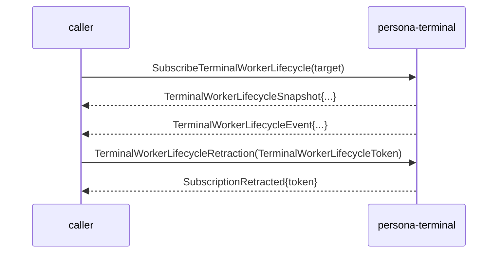

# signal-persona-terminal — architecture

*Signal contract for Persona terminal transport control.*

## 0 · TL;DR

`signal-persona-terminal` is the typed communication contract
`persona-harness` (and router delivery adapters) use to ask
`persona-terminal` for terminal work. The raw attached-viewer byte
plane stays outside this contract: PTY bytes, socket bytes, and
viewer-pump bytes live in `terminal-cell` / `persona-terminal`
implementation code, not in Signal frames. Engine lifecycle/readiness
traffic is the separate `signal-persona::SupervisionRequest` relation;
do not call the component communication socket a supervision socket.
Owner-only terminal session lifecycle commands live in the separate
`owner-signal-persona-terminal` contract. This ordinary surface can
read the session registry; it cannot create or retire sessions.

## MUST IMPLEMENT — three-layer migration

This contract is migrating to the three-layer model affirmed
2026-05-20 per
`primary/reports/designer/246-v4-bundled-fix-deep-design-with-examples.md`
and `primary/reports/designer/248-three-layer-changes-for-operators.md`.

**Layer 1 — Contract Operations on the wire (this crate).** Drop the
SignalVerb prefixes entirely. The surface splits across four concern
groups, each needing a contract-local verb:

- Transport (`Connect`, `Input`, `Resize`, `Detach`, `Capture` —
  verb-form names for the current `TerminalConnection`,
  `TerminalInput`, `TerminalResize`, `TerminalDetachment`,
  `TerminalCapture`);
- Session discovery (`Query` for both `ListSessions` and
  `ResolveSession`, payload distinguishes);
- Prompt-pattern registry (`Register`, `Unregister`, `Query` for
  `RegisterPromptPattern`, `UnregisterPromptPattern`,
  `ListPromptPatterns`);
- Input-gate / injection (`Acquire`, `Release`, `Inject` for
  `AcquireInputGate`, `ReleaseInputGate`, `WriteInjection`);
- Worker-lifecycle subscription (`Watch` for
  `SubscribeTerminalWorkerLifecycle`, `Unwatch` for
  `TerminalWorkerLifecycleRetraction`).

Drop redundant `Terminal*` prefixes throughout — crate namespace
supplies it.

**Mandatory `Tap`/`Untap` for persona components.** Persona-terminal
is a persona component, so its observable surface is standardized.
Add a mandatory `observable { … }` block; the macro injects
`Tap(ObserverFilter)` / `Untap(TerminalObserverSubscriptionToken)`
verbs for the standardized observer hook. The domain-specific
`Watch`/`Unwatch` for worker lifecycle coexists without collision.

**Layer 2 — Component Commands (persona-terminal daemon).** The
terminal daemon owns its typed Command enum (e.g.
`TerminalCommand::AssertConnection`,
`TerminalCommand::DeliverInput`,
`TerminalCommand::MutateGeometry`,
`TerminalCommand::AcquireInputGate`,
`TerminalCommand::RecordInjection`,
`TerminalCommand::ReadSessionList`,
`TerminalCommand::OpenWorkerLifecycleStream`) plus a
`CommandExecutor`.

**Layer 3 — Sema classification (signal-sema).** Each Component
Command projects to a payloadless `SemaOperation` class via
`ToSemaOperation`.

**Frame layer.** The dependency on `signal-core` shifts to
`signal-frame`.

References:
- `primary/reports/designer/246-v4-bundled-fix-deep-design-with-examples.md`
- `primary/reports/designer/248-three-layer-changes-for-operators.md`
- `primary/skills/component-triad.md` §"Verbs come in three layers"
- `primary/skills/contract-repo.md` §"Public contracts use contract-local operation verbs"

**Note to remover:** when the refactor lands, remove this section and
add a `## Migration history — three-layer model (2026-05-XX)`
paragraph noting the shape change.

There is one `signal_channel!` invocation in `src/lib.rs` declaring
the `Terminal` channel. Terminal-owned introspection records (typed
projections of durable Sema rows for `persona-introspect`) live in
`src/introspection.rs`.

Subscription close on the terminal-worker-lifecycle stream follows
the **Path A** discipline per /181 and
`~/primary/reports/designer-assistant/91-user-decisions-after-designer-184-200-critique.md`
§2: a request-side `Retract TerminalWorkerLifecycleRetraction` carries
the per-stream token; the terminal responds with
`TerminalReply::SubscriptionRetracted` echoing the token.

## 1 · Channel

| Side | Component |
|---|---|
| Request side | Persona components that need terminal transport (today: `persona-harness` and router delivery adapters). |
| Reply / event side | `persona-terminal` |

Two control surfaces share the channel:

- **Harness transport**: `persona-harness` requests connection,
  input, resize, detachment, and capture vectors. `persona-terminal`
  emits readiness, input acceptance, transcript, resize, detachment,
  capture, exit, and rejection events.
- **Terminal control**: `persona-terminal` owns prompt-pattern
  registry, input-gate leases, write-injection acknowledgements, and
  worker-lifecycle observations. It may implement those facts on top
  of `terminal-cell` primitives, but `terminal-cell` is not the
  Persona-facing contract endpoint.

The steady-state flow is pushed by the transport owner. Harnesses
and callers do not poll for transcript or lifecycle state.

## 2 · Wire vocabulary

Records local to this contract (see source for the full list):

- Terminal identity: `TerminalName`, `TerminalGeneration`,
  `TerminalSequence`.
- Byte and geometry types: `TerminalInputBytes`,
  `TerminalTranscriptBytes`, `TerminalRows`, `TerminalColumns`,
  `TerminalByteCount`.
- Prompt-pattern records: `PromptPatternId`, `PromptPatternBytes`,
  `PromptPattern`, `RegisterPromptPattern`, `UnregisterPromptPattern`,
  `ListPromptPatterns`, `PromptPatternEntry`, `PromptPatternRegistered`,
  `PromptPatternUnregistered`, `PromptPatternList`.
- Input-gate records: `InputGateReason`, `InputGateLeaseId`,
  `InputGateLease`, `PromptState`, `AcquireInputGate`,
  `ReleaseInputGate`, `WriteInjection`, `GateAcquired`, `GateBusy`,
  `GateReleased`, `InjectionAck`, `InjectionRejected`,
  `InjectionRejectionReason`.
- Worker-lifecycle subscription records:
  `SubscribeTerminalWorkerLifecycle`, `TerminalWorkerLifecycleToken`,
  `SubscriptionRetracted`, `TerminalWorkerKind`,
  `TerminalWorkerStopReason`, `TerminalWorkerLifecycle`,
  `TerminalWorkerLifecycleSnapshot`, `TerminalWorkerLifecycleEvent`.
- Connection / transport: `TerminalConnection`, `TerminalInput`,
  `TerminalResize`, `TerminalDetachment`, `TerminalCapture`,
  `TerminalReady`, `TerminalInputAccepted`, `TranscriptDelta`,
  `TerminalResized`, `TerminalCaptured`, `TerminalDetached`,
  `TerminalExited`, `TerminalRejected`.
- Session registry reads: `ListSessions`, `ResolveSession`,
  `SessionEntry`, `SessionList`, `SessionResolved`.
- Introspection projections (in `src/introspection.rs`):
  `TerminalObservationSequence`, `TerminalSocketPath`,
  `TerminalViewerName`, `TerminalArchiveReason`,
  `TerminalSessionState`, `TerminalSessionObservation`,
  `TerminalDeliveryAttemptState`, `TerminalDeliveryAttemptObservation`,
  `TerminalEventObservation`, `TerminalViewerAttachmentState`,
  `TerminalViewerAttachmentObservation`,
  `TerminalSessionHealthObservation`, `TerminalSessionArchiveState`,
  `TerminalSessionArchiveObservation`, `TerminalIntrospectionSnapshot`.

The records are terminal-transport vocabulary. They are not router,
message, auth, or terminal raw-data records.

## 3 · Messages

```text
TerminalRequest                          TerminalReply
├─ TerminalConnection                    ├─ TerminalReady
├─ TerminalInput                         ├─ TerminalInputAccepted
├─ TerminalResize                        ├─ TerminalResized
├─ TerminalDetachment                    ├─ TerminalCaptured
├─ TerminalCapture                       ├─ TranscriptDelta
├─ ListSessions                          ├─ SessionList
├─ ResolveSession                        ├─ SessionResolved
├─ RegisterPromptPattern                 ├─ TerminalDetached
├─ UnregisterPromptPattern               ├─ TerminalExited
├─ ListPromptPatterns                    ├─ TerminalRejected
├─ AcquireInputGate                      ├─ PromptPatternRegistered
├─ ReleaseInputGate                      ├─ PromptPatternUnregistered
├─ WriteInjection                        ├─ PromptPatternList
├─ SubscribeTerminalWorker...            ├─ GateAcquired
└─ TerminalWorkerLifecycleRetraction     ├─ GateBusy
                                         ├─ GateReleased
                                         ├─ InjectionAck
                                         ├─ InjectionRejected
                                         ├─ TerminalRequestUnimplemented
                                         ├─ TerminalWorkerLifecycleSnapshot
                                         ├─ TerminalWorkerLifecycleEvent
                                         └─ SubscriptionRetracted

(TerminalWorkerLifecycleEvent flows on TerminalWorkerLifecycleStream.)
```

Closed enums; typed rejection reasons; no string-tagged event kinds.

### Path A lifecycle on the worker-lifecycle stream



The request retract variant is required by the `signal_channel!`
stream-block grammar; the reply ack is the final event consumers
bind their in-flight subscribe to.

### Sema-class projections (Layer 3)

Each contract-local operation's daemon-side Component Command
projects to a payloadless Sema class label for observation:

```text
Connect                            -> Assert
Input                              -> Assert
Resize                             -> Mutate
Detach                             -> Retract
Capture                            -> Match
Query (ListSessions)               -> Match
Query (ResolveSession)             -> Match
Register (PromptPattern)           -> Assert
Unregister (PromptPattern)         -> Retract
Query (ListPromptPatterns)         -> Match
Acquire (InputGate)                -> Assert
Release (InputGate)                -> Retract
Inject (WriteInjection)            -> Assert
Watch (WorkerLifecycle)            -> Subscribe   (opens TerminalWorkerLifecycleStream)
Unwatch (WorkerLifecycle)          -> Retract     (closes TerminalWorkerLifecycleStream)
Tap (mandatory observability)      -> Subscribe
Untap (mandatory observability)    -> Retract
```

The wire form carries the contract-local verb only; the Sema class
label is computed at observation publish time inside the daemon.
Session lifecycle mutation is intentionally absent here; it belongs
to `owner-signal-persona-terminal`.

### Skeleton honesty (Unimplemented event)

```text
TerminalUnimplementedReason
  | NotInPrototypeScope
  | DependencyMissing(DependencyKind)
  | ResourceUnavailable(ResourceKind)

TerminalRequestUnimplemented
  | terminal:    TerminalName
  | operation:   TerminalOperationKind          (closed enum mirroring TerminalRequest variants)
  | reason:      TerminalUnimplementedReason
```

When a `TerminalRequest` variant has no built behavior yet,
`persona-terminal` emits `TerminalRequestUnimplemented` rather than
panicking or producing a generic rejection.

### Injection ordering

`WriteInjection` carries an `injection_sequence: u64` so the
gate-lease holder's writes are sequenced. Out-of-order use returns
`InjectionRejectionReason::InvalidSequence`.

```text
WriteInjection
  | terminal:           TerminalName
  | lease:              InputGateLease
  | injection_sequence: u64
  | bytes:              TerminalInputBytes
```

### `TerminalName` namespace scope

`TerminalName` identifies a supervised terminal session. For the
prototype, the canonical scope is "one role per name" —
`TerminalName::new("operator")`, `TerminalName::new("designer")`,
etc. Future cases where multiple harnesses share a role get a
richer namespace; until then, the name space matches the role-name
vocabulary in `signal-persona-mind::RoleName`.

## 4 · Terminal-Cell Control

Prompt-pattern records let a caller register the terminal-ready
shape that makes write injection safe to attempt. Input-gate records
make the exclusive write lease explicit and include prompt state in
the acquisition reply. Write-injection records acknowledge the
terminal generation and sequence produced by a successful write.
Worker-lifecycle records expose transport task start/stop
observations as typed events.

This contract does not decide whether a write should happen. It only
carries the transport control facts needed by `persona-terminal` and
its consumers.

## 5 · Introspection records

Terminal durable Sema rows that need to be inspectable outside
`persona-terminal` have typed record shapes in this contract. The
component still owns its redb file, table declarations, reducers,
consistency model, and redaction policy. `persona-introspect` asks
the running component for these records; it does not open
`persona-terminal`'s database directly.

`TerminalIntrospectionSnapshot` is the prototype projection bundle
over: terminal session observations; delivery attempt observations;
terminal event observations; viewer attachment observations; session
health observations; session archive observations.

These records are not router, harness, message, or terminal-cell
records. They name terminal-owned inspectable state at the Persona
terminal boundary.

## 6 · Constraints

| Constraint | Witness |
|---|---|
| Every request/reply travels as a Signal frame. | `tests/round_trip.rs` length-prefixed frame tests per variant. |
| Every `TerminalRequest` variant is a contract-local verb in verb form. | Round-trip tests assert each variant's NOTA head. Sema classification is daemon-side projection only. |
| Session lifecycle mutation is owner-only, not part of the ordinary terminal contract. | Source scan: ordinary `TerminalRequest` has no `CreateSession` or `RetireSession`; those records live in `owner-signal-persona-terminal`. |
| Session lookup is a read; its Component Command projects to Sema `Match`. | `ListSessions` and `ResolveSession` return typed session rows or typed rejection from the daemon. |
| Subscription close uses **Path A**: request-side `Retract TerminalWorkerLifecycleRetraction` carrying the token, plus reply-side `SubscriptionRetracted` ack echoing the token. | The `signal_channel!` declaration names `Retract TerminalWorkerLifecycleRetraction(TerminalWorkerLifecycleToken)` and a `stream TerminalWorkerLifecycleStream { close TerminalWorkerLifecycleRetraction; … }` block. The kernel grammar (`signal-frame::macros::validate`) rejects a `stream` block whose `close` is not a request-side `Retract` variant. Wire witnesses cover the retract request and the reply ack. |
| Wire enums contain no `Unknown` variant. | Source scan: only `InjectionRejectionReason::{UnknownTerminal,UnknownLease}` carry the word "Unknown" and those are positive domain rejections (see next row). |
| Any record name containing the word `Unknown` represents a positive "entity not in our state" rejection, not a polling-shape escape hatch. | `InjectionRejectionReason::UnknownTerminal` and `UnknownLease` name "the terminal/lease id you sent isn't in our state" — closed, positively-defined failure modes, not lifecycle uncertainty placeholders. |
| Skeleton honesty uses typed reasons, not free text. | `TerminalRequestUnimplemented.operation` is the closed `TerminalOperationKind`; `reason` is the closed `TerminalUnimplementedReason`. |
| Injection ordering is enforced by sequence number, not retry. | `WriteInjection.injection_sequence`; out-of-order use returns `InjectionRejectionReason::InvalidSequence`. |
| Each variant's NOTA head matches the contract-local verb declared in `signal_channel!`. | Generated by the macro; round-trip witness asserts each variant's head. |
| Round-trip witnesses cover every variant in rkyv. | `tests/round_trip.rs` covers every request, reply, and event variant. |
| Round-trip witnesses cover every variant in NOTA. | `examples/canonical.nota` holds one canonical text example per request/reply/event variant; round-trip tests parse and re-emit each. |
| No stringly-typed dispatch (`match s.as_str()`) for closed-set states. | All kind / reason / state fields are typed closed enums. |
| Contract crate dependencies use a named API reference (branch or tag), not a raw revision pin. | `Cargo.toml` review: `signal-frame` is declared `git = "..."` with a named-branch shape; raw `rev = "..."` pins are not used. |
| Runtime code stays out of the contract. | Source scan: no Kameo, Tokio, socket, or redb code. |

## 7 · NOTA codec quirk on `signal_channel!` payload heads

The `signal_channel!` macro emits a request variant's NOTA head as
the **payload's record head**, not the Rust variant name. For
example, `TerminalRequest::TerminalWorkerLifecycleRetraction(TerminalWorkerLifecycleToken { .. })`
encodes as `(TerminalWorkerLifecycleToken (...))`, not
`(TerminalWorkerLifecycleRetraction ...)`. Canonical examples and
round-trip tests carry the payload heads.

## 8 · Versioning

`signal_frame::Frame` carries the protocol version. Schema-level
changes are breaking; coordinate `persona-harness`,
`persona-terminal`, and terminal-cell transport on the upgrade.

This crate depends on `signal-frame` via a named-branch reference, not
a raw revision pin. The destination is a stable `signal-frame` API
branch/bookmark once that lane is declared.

## 9 · Non-ownership

- No terminal daemon. That is `persona-terminal`.
- No harness actor. That is `persona-harness`.
- No router delivery policy. That is `persona-router`.
- No OS focus policy. That is `persona-system`.
- No terminal-cell daemon. That is `terminal-cell`, behind
  `persona-terminal`.
- No owner-only terminal session lifecycle commands. Those are
  `owner-signal-persona-terminal`.
- No prompt interpretation or delivery policy. That belongs in the
  caller and transport owner, not this contract.
- No raw PTY / viewer byte data plane.
- No transport loop, reconnect policy, or socket path.

## 10 · Code map

```text
src/
├── lib.rs                — control payloads + signal_channel! invocation
└── introspection.rs      — terminal-owned inspectable-state record shapes
examples/
└── canonical.nota         — one canonical example per request/reply/event variant
tests/
├── round_trip.rs          — per-variant frame round trips + NOTA witnesses
│                            + closed-enum + verb-mapping witnesses
│                            + canonical examples parser
│                            + full subscribe/event/retract/ack lifecycle witness
└── introspection.rs       — rkyv + NOTA witnesses for inspection records
```

## See also

- `signal-frame/macros/src/validate.rs` — the macro and stream-block
  grammar that enforces the request-side retract variant.
- `~/primary/skills/component-triad.md` §"Verbs come in three layers".
- `signal-persona-harness/ARCHITECTURE.md` — sibling contract using
  the same Path A subscription discipline.
- `owner-signal-persona-terminal/ARCHITECTURE.md` — owner-only
  terminal session lifecycle mutation contract.
- `signal-persona-system/ARCHITECTURE.md` and
  `signal-criome/ARCHITECTURE.md` — sibling contracts using the same
  Path A subscription discipline.
- `persona-harness/ARCHITECTURE.md`
- `persona-terminal/ARCHITECTURE.md`
- `persona-router/ARCHITECTURE.md`
- `terminal-cell/ARCHITECTURE.md`
