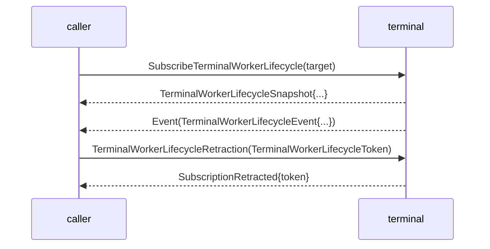

# signal-terminal — architecture

*Schema-derived Signal contract for Persona terminal transport control.*

## 0 · TL;DR

`signal-terminal` is the typed working wire contract `harness` (and router
delivery adapters) use to ask `terminal` for terminal work. The raw
attached-viewer byte plane stays outside this contract: PTY bytes, socket
bytes, and viewer-pump bytes live in `terminal-cell` / `terminal`
implementation code, never in Signal frames.

The component has exactly two Signal contracts: this ordinary
`signal-terminal` working contract, and the separate terminal meta signal
contract that carries meta-only session lifecycle commands (create / retire).
This ordinary surface can read the session registry; it cannot create or
retire sessions. The binary `TerminalDaemonConfiguration` carried here
includes ordinary, meta, and supervision socket paths because it is the
generated process launch record; those fields do not turn meta lifecycle
mutation into ordinary signal traffic.

## 1 · Schema-derived emission

`schema/lib.schema` is the single source of truth. `build.rs` runs
`schema_rust_next::build::ContractCrateBuild::from_environment` with
`expect_fresh()`, which regenerates the checked-in `src/schema/lib.rs`
(`// @generated by schema-rust-next`) and fails the build if the artifact
drifts from the schema. The schema document is positional: an `[Input]`
root-enum block (auto-named `Input`), an `[Output]` root-enum block
(auto-named `Output`), then a `{ … }` namespace block carrying every helper
type plus the `Stream` declaration.

The generator emits the closed `Input`, `Output`, and `TerminalEvent` roots,
all payload records, the rkyv codec, the optional NOTA codec, the per-variant
`From<Payload>` lifts, and the `signal-frame` transport surface. Because this
contract owns a worker-lifecycle stream, the generated envelope is
`signal_frame::StreamingFrame<Input, Output, TerminalEvent>` (with the
matching `StreamingFrameBody`), not the request/reply-only `ExchangeFrame`.
The `Output` root carries an `Event(TerminalEvent)` variant whose payload type
equals the stream's event type; that equality is what drives streaming
emission.

This crate owns wire vocabulary and codecs only. Sema classification is a
daemon-side projection; it never appears on the wire. Because the contract
owns NOTA round-trip witnesses, it enables `signal-frame/nota-text` through
its own default `nota-text` feature, which also pulls in the optional
`nota-next` dependency that backs the generated and hand-written NOTA derives.

Terminal-owned introspection records (typed projections of durable Sema rows
for `persona-introspect`) stay hand-written in `src/introspection.rs`; the
contract may own those record shapes directly. Their one cross-type reference
is the generated `Output` reply root.

Subscription close on the worker-lifecycle stream follows the **Path A**
discipline: a request-side `TerminalWorkerLifecycleRetraction` carries the
per-stream `TerminalWorkerLifecycleToken`; the terminal responds with
`Output::SubscriptionRetracted` echoing the token.

## 2 · Channel

| Side | Component |
|---|---|
| Request side | Persona components that need terminal transport (today: `harness` and router delivery adapters). |
| Reply / event side | `terminal` |

Two control surfaces share the channel:

- **Harness transport**: `harness` requests connection, input, resize,
  detachment, and capture vectors. `terminal` emits readiness, input
  acceptance, transcript, resize, detachment, capture, exit, and rejection
  outputs.
- **Terminal control**: `terminal` owns the prompt-pattern registry,
  input-gate leases, write-injection acknowledgements, and worker-lifecycle
  observations. It may implement those facts on top of `terminal-cell`
  primitives, but `terminal-cell` is not the Persona-facing contract endpoint.

The steady-state flow is pushed by the transport owner. Harnesses and callers
do not poll for transcript or lifecycle state.

## 3 · Wire vocabulary

Records local to this contract (see `schema/lib.schema` for the full list):

- Terminal identity: `TerminalName`, `TerminalGeneration`,
  `TerminalSequence`.
- Byte and geometry types: `TerminalInputBytes`, `TerminalTranscriptBytes`,
  `TerminalRows`, `TerminalColumns`, `TerminalByteCount`. Byte fields are
  modeled as `(Vec Integer)` — one unsigned integer per byte — because the
  schema primitive set is `String`, `Integer`, and `Boolean` only.
- Prompt-pattern records: `PromptPatternIdentifier`, `PromptPatternBytes`,
  `PromptPattern`, `RegisterPromptPattern`, `UnregisterPromptPattern`,
  `ListPromptPatterns`, `PromptPatternEntry`, `PromptPatternRegistered`,
  `PromptPatternUnregistered`, `PromptPatternList`.
- Input-gate records: `InputGateReason`, `InputGateLeaseIdentifier`,
  `InputGateLease`, `PromptState`, `AcquireInputGate`, `ReleaseInputGate`,
  `WriteInjection`, `GateAcquired`, `GateBusy`, `GateReleased`,
  `InjectionAck`, `InjectionRejected`, `InjectionRejectionReason`.
- Worker-lifecycle subscription records: `SubscribeTerminalWorkerLifecycle`,
  `TerminalWorkerLifecycleToken`, `SubscriptionRetracted`,
  `TerminalWorkerKind`, `TerminalWorkerStop`, `TerminalWorkerStopReason`,
  `TerminalWorkerLifecycle`, `TerminalWorkerLifecycleSnapshot`,
  `TerminalWorkerLifecycleEvent`.
- Connection / transport: `TerminalConnection`, `TerminalInput`,
  `TerminalResize`, `TerminalDetachment`, `TerminalCapture`, `TerminalReady`,
  `TerminalInputAccepted`, `TranscriptDelta`, `TerminalResized`,
  `TerminalCaptured`, `TerminalDetached`, `TerminalExited`,
  `TerminalExitStatus`, `TerminalRejected`.
- Session registry reads: `ListSessions`, `ResolveSession`, `SessionEntry`,
  `SessionList`, `SessionResolved`.
- Local socket / owner vocabulary (declared in-schema, no upstream imports):
  `WirePath`, `SocketMode`, `SystemPrincipal`, `UnixUserIdentifier`,
  `OwnerIdentity`, `TerminalDaemonConfiguration`.
- Introspection projections (hand-written in `src/introspection.rs`):
  `TerminalObservationSequence`, `TerminalControlSocketPath`,
  `TerminalDataSocketPath`, `TerminalViewerName`, `TerminalArchiveReason`,
  `TerminalSessionState`, `TerminalSessionObservation`,
  `TerminalDeliveryAttemptState`, `TerminalDeliveryAttemptObservation`,
  `TerminalEventObservation`, `TerminalViewerAttachmentState`,
  `TerminalViewerAttachmentObservation`, `TerminalSessionHealthObservation`,
  `TerminalSessionArchiveState`, `TerminalSessionArchiveObservation`,
  `TerminalIntrospectionSnapshot`.

The records are terminal-transport vocabulary. They are not router, message,
auth, or terminal raw-data records.

## 4 · Messages

```text
Input                                    Output
├─ TerminalConnection                    ├─ TerminalReady
├─ TerminalInput                         ├─ TerminalInputAccepted
├─ TerminalResize                        ├─ TranscriptDelta
├─ TerminalDetachment                    ├─ TerminalResized
├─ TerminalCapture                       ├─ TerminalCaptured
├─ RegisterPromptPattern                 ├─ TerminalDetached
├─ UnregisterPromptPattern               ├─ TerminalExited
├─ ListPromptPatterns                    ├─ TerminalRejected
├─ AcquireInputGate                      ├─ PromptPatternRegistered
├─ ReleaseInputGate                      ├─ PromptPatternUnregistered
├─ WriteInjection                        ├─ PromptPatternList
├─ SubscribeTerminalWorkerLifecycle      ├─ GateAcquired
├─ TerminalWorkerLifecycleRetraction     ├─ GateBusy
├─ ListSessions                          ├─ GateReleased
└─ ResolveSession                        ├─ InjectionAck
                                         ├─ InjectionRejected
                                         ├─ TerminalWorkerLifecycleSnapshot
                                         ├─ SubscriptionRetracted
                                         ├─ SessionList
                                         ├─ SessionResolved
                                         └─ Event(TerminalEvent)

(TerminalEvent::TerminalWorkerLifecycleEvent flows on
 TerminalWorkerLifecycleStream as Output::Event / a SubscriptionEvent frame.)
```

Closed enums; typed rejection reasons; no string-tagged event kinds.

### Path A lifecycle on the worker-lifecycle stream



The request-side retraction operation is what the stream's `close` slot names;
the reply ack is the final event consumers bind their in-flight subscribe to.

### Remodeled enum shapes

The schema enum grammar admits unit and single-payload variants only — no
struct or multi-field variants. The terminal vocabulary that previously used
struct/tuple variants is remodeled accordingly:

```text
TerminalExitStatus
  | Exited(ExitCode)
  | Signaled(TerminalSignalNumber)
  | StatusUnavailable

PromptState
  | NotChecked
  | Clean
  | Dirty(TerminalByteCount)

PromptPattern
  | LiteralSuffix(PromptPatternBytes)
  | RegexSuffix(PromptPatternBytes)

TerminalWorkerLifecycle
  | Started(TerminalWorkerKind)
  | Stopped(TerminalWorkerStop)            (TerminalWorkerStop { worker, reason })

TerminalWorkerStopReason
  | …InputWriteFailed(WorkerFailureDetail)…   (failure payloads are the
                                               WorkerFailureDetail newtype, not
                                               a bare String)
```

### Sema-class projections (Layer 3)

Each contract-local operation's daemon-side Component Command projects to a
payloadless Sema class label for observation:

```text
TerminalConnection                 -> Assert
TerminalInput                      -> Assert
TerminalResize                     -> Mutate
TerminalDetachment                 -> Retract
TerminalCapture                    -> Match
ListSessions                       -> Match
ResolveSession                     -> Match
RegisterPromptPattern              -> Assert
UnregisterPromptPattern            -> Retract
ListPromptPatterns                 -> Match
AcquireInputGate                   -> Assert
ReleaseInputGate                   -> Retract
WriteInjection                     -> Assert
SubscribeTerminalWorkerLifecycle   -> Subscribe   (opens TerminalWorkerLifecycleStream)
TerminalWorkerLifecycleRetraction  -> Retract     (closes TerminalWorkerLifecycleStream)
```

The wire form carries the contract-local operation head only; the Sema class
label is computed at observation publish time inside the daemon. Session
lifecycle mutation is intentionally absent here; it belongs to the terminal
meta signal contract.

### Injection ordering

`WriteInjection` is lease-scoped. The caller supplies the terminal, input-gate
lease, and bytes; `terminal` mints the resulting terminal generation and
sequence in `InjectionAck`.

```text
WriteInjection
  | terminal:           TerminalName
  | lease:              InputGateLease
  | bytes:              TerminalInputBytes
```

### `TerminalName` namespace scope

`TerminalName` identifies a supervised terminal session. For the prototype,
the canonical scope is "one role per name" — `TerminalName::new("operator")`,
`TerminalName::new("designer")`, etc. Future cases where multiple harnesses
share a role get a richer namespace; until then, the name space matches the
role-name vocabulary in `signal-mind::RoleName`.

## 5 · Terminal-cell control

Prompt-pattern records let a caller register the terminal-ready shape that
makes write injection safe to attempt. Input-gate records make the exclusive
write lease explicit and include prompt state in the acquisition reply.
Write-injection records acknowledge the terminal generation and sequence
produced by a successful write. Worker-lifecycle records expose transport task
start/stop observations as typed events.

This contract does not decide whether a write should happen. It only carries
the transport control facts needed by `terminal` and its consumers.

## 6 · Introspection records

Terminal durable Sema rows that need to be inspectable outside `terminal` have
typed record shapes in this contract. The component still owns its Sema store,
table declarations, reducers, consistency model, and redaction policy.
`persona-introspect` asks the running component for these records; it does not
open `terminal`'s database directly.

`TerminalIntrospectionSnapshot` is the prototype projection bundle over:
terminal session observations; delivery attempt observations; terminal event
observations; viewer attachment observations; session health observations;
session archive observations. The `TerminalEventObservation` record references
the generated `Output` reply root for its event field.

These records are not router, harness, message, or terminal-cell records. They
name terminal-owned inspectable state at the Persona terminal boundary.

## 7 · Constraints

| Constraint | Witness |
|---|---|
| The generated artifact stays fresh against the schema. | `build.rs` runs `ContractCrateBuild::expect_fresh()`; a plain build fails if `src/schema/lib.rs` drifts from `schema/lib.schema`. |
| Every request/reply travels as a Signal frame. | `tests/round_trip.rs` length-prefixed frame tests over every variant. |
| The worker-lifecycle stream rides the streaming envelope. | The generated `Frame` is `StreamingFrame<Input, Output, TerminalEvent>`; `tests/round_trip.rs` round-trips a `SubscriptionEvent` frame. |
| Subscription close uses **Path A**: request-side `TerminalWorkerLifecycleRetraction` carrying the token, plus reply-side `SubscriptionRetracted` ack echoing the token. | The schema names the retraction operation and the stream's `close` slot; round-trip witnesses cover the retract request and the reply ack. |
| Session lifecycle mutation is meta-only, not part of the ordinary terminal contract. | The `Input` root has no `CreateSession` or `RetireSession`; those records live in the terminal meta signal contract. |
| Wire enums contain no `Unknown` escape hatch. | Only `InjectionRejectionReason::{UnknownTerminal,UnknownLease}` carry the word "Unknown" and those are positive domain rejections (see next row). |
| Any record name containing `Unknown` is a positive "entity not in our state" rejection, not a polling-shape placeholder. | `InjectionRejectionReason::UnknownTerminal` / `UnknownLease` name "the terminal/lease id you sent isn't in our state" — closed, positively-defined failure modes. |
| Byte fields carry one integer per byte on the wire. | `TerminalInputBytes` / `TerminalTranscriptBytes` / `PromptPatternBytes` are `(Vec Integer)`; `tests/round_trip.rs` asserts the per-byte text form. |
| Write injection is lease-scoped; terminal mints the resulting sequence. | `WriteInjection` carries `InputGateLease`; `InjectionAck` carries the generated `TerminalGeneration` and `TerminalSequence`. |
| Round-trip witnesses cover every variant in rkyv and NOTA. | `tests/round_trip.rs` covers every request, reply, and event variant; `examples/canonical.nota` holds one canonical text example per family and `tests/canonical_examples.rs` parses and re-emits each. |
| No stringly-typed dispatch for closed-set states. | All kind / reason / state fields are typed closed enums. |
| Runtime code stays out of the contract. | No Kameo, Tokio, socket, or storage code. |

## 8 · NOTA codec shape

The generated codec emits each operation's NOTA head from the variant name.
Single-field payload records flatten through their newtype, so a one-field
operation head carries its inner value directly — e.g.
`Input::TerminalConnection(TerminalConnection(TerminalName))` encodes as
`(TerminalConnection [operator])`, while a multi-field operation nests its
fields — `(TerminalResize ([operator] 24 80))`. Canonical examples and
round-trip tests carry the operation heads.

## 9 · Versioning

`signal_frame::Frame` carries the protocol version. Schema-level changes
(adding/removing variants, changing payload shapes) are breaking; coordinate
`harness`, `terminal`, and terminal-cell transport on the upgrade. This crate
depends on `signal-frame` via a named-branch reference, not a raw revision pin.

## 10 · Possible features (not decided)

These are documented shapes that are **not** in the wire today. None of them
appear in `schema/lib.schema` or the generated surface; they are recorded here
so a future schema bump has a starting point, not a backlog commitment.

- **Skeleton honesty (`TerminalRequestUnimplemented`).** A typed
  accepted-but-unimplemented reply, mirroring `signal-message`'s
  `MessageRequestUnimplemented`. It would carry the closed
  `TerminalOperationKind` plus a closed `TerminalUnimplementedReason`
  (`NotInPrototypeScope` / `DependencyMissing(DependencyKind)` /
  `ResourceUnavailable(ResourceKind)`), so a valid request with no built
  behavior yet returns a typed reply rather than a panic or generic rejection.
  The current `Output` root carries the 20 working replies plus
  `Event(TerminalEvent)`; adding this reply is a deliberate future schema
  change, not present in code.

## 11 · Non-ownership

- No terminal daemon. That is `terminal`.
- No harness actor. That is `harness`.
- No router delivery policy. That is `router`.
- No OS focus policy. That is `system`.
- No terminal-cell daemon. That is `terminal-cell`, behind `terminal`.
- No meta-only terminal session lifecycle commands. Those are in the terminal
  meta signal contract.
- No prompt interpretation or delivery policy. That belongs in the caller and
  transport owner, not this contract.
- No raw PTY / viewer byte data plane.
- No transport loop, reconnect policy, or socket path.

## 12 · Code map

```text
build.rs                   — schema-rust-next ContractCrateBuild::expect_fresh
schema/
└── lib.schema             — authored contract vocabulary (source of truth)
src/
├── lib.rs                 — generated re-export + contract-local methods on
│                            generated nouns (accessors, operation_kind,
│                            TerminalDaemonConfiguration rkyv codec + error)
├── schema/
│   ├── mod.rs
│   └── lib.rs             — generated WireContract artifact (@generated)
└── introspection.rs       — hand-written terminal inspectable-state records
examples/
└── canonical.nota         — one canonical example per request/reply/event family
tests/
├── round_trip.rs          — per-variant streaming-frame round trips + NOTA witnesses
├── canonical_examples.rs  — canonical.nota parser / re-emit witness
├── introspection.rs       — rkyv + NOTA witnesses for inspection records
└── dependency_boundary.rs — schema-derived / no-retired-helper-deps assertions
```

## See also

- `~/primary/skills/component-triad.md` §"Verbs come in three layers".
- `signal-message/ARCHITECTURE.md` — sibling schema-derived contract.
- The terminal meta signal contract — meta-only terminal session lifecycle
  contract.
- `harness/ARCHITECTURE.md`
- `terminal/ARCHITECTURE.md`
- `router/ARCHITECTURE.md`
- `terminal-cell/ARCHITECTURE.md`
```
